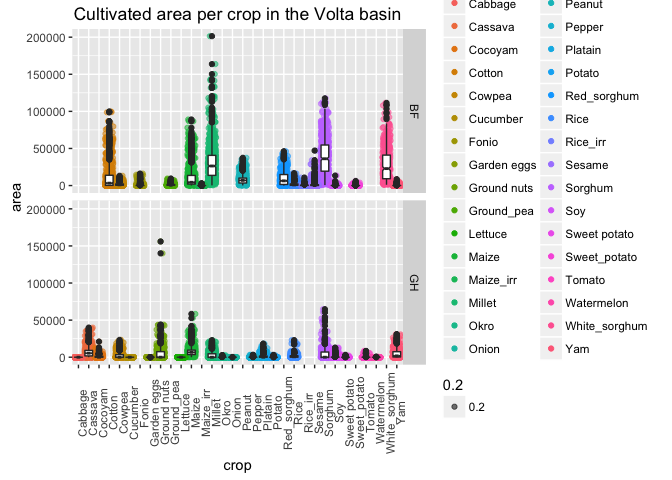
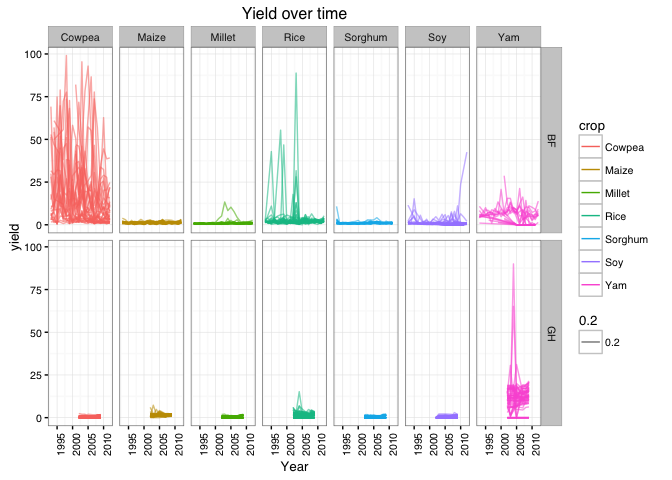

Volta Preliminary Analysis
================
Juan Carlos Rocha

TAI-Volta project
-----------------

The TAI-Volta project goal is **targeting agricultural innovations** in the Volta river basin, between Ghana and Burkina Faso. This document presents a preliminary analysis of the data we've got so far as a showcase of we can do once more data comes into the pipeline. Katja Malmborg has been collecting data from project collaborators and the statistics beaureau from both countries. Raw data are mainly excel files with several tables per sheet indicating area or crops production over time per district or province. She has organized the tables on suitable files (one table per sheet at least) and has also collected socio-economic information from national census reports. I use the script `ExtractDataTAI.R` to mine the different data files and compile a unique data object.

### Data so far..

To date we have 22500 observations that comprises 32 crop production (in metric Tons) and cultivated area (in Km2) for the 99 provinces (in Burkina Faso) and districts (in Ghana) from 1993 to 2012. However, we do have also over 4000 missing values or `NA's`. Below a summary of the cleaned data:

    ## 'data.frame':    22500 obs. of  7 variables:
    ##  $ TAI_ID1: int  3103 3108 3113 3116 3117 3118 3203 3204 3206 3207 ...
    ##  $ Year   : num  2002 2002 2002 2002 2002 ...
    ##  $ crop   : Factor w/ 32 levels "Cabbage","Cassava",..: 12 12 12 12 12 12 12 12 12 12 ...
    ##  $ area   : num  3594 4134 32978 6286 9537 ...
    ##  $ prod   : num  7790 9954 41499 11337 34157 ...
    ##  $ country: Factor w/ 2 levels "BF","GH": 2 2 2 2 2 2 2 2 2 2 ...
    ##  $ TAI_ID2: Factor w/ 99 levels "1113","1115",..: 40 41 42 43 44 45 46 47 48 49 ...

    ##     TAI_ID1          Year           crop            area         
    ##  Min.   :1113   Min.   :1993   Cowpea : 1200   Min.   :     0.0  
    ##  1st Qu.:1625   1st Qu.:2001   Maize  : 1200   1st Qu.:     0.0  
    ##  Median :2137   Median :2004   Millet : 1200   Median :   177.2  
    ##  Mean   :2461   Mean   :2004   Rice   : 1200   Mean   :  5752.7  
    ##  3rd Qu.:3412   3rd Qu.:2008   Sorghum: 1200   3rd Qu.:  4100.0  
    ##  Max.   :3912   Max.   :2012   Soy    : 1200   Max.   :201397.4  
    ##                                (Other):15300   NA's   :4189      
    ##       prod        country       TAI_ID2     
    ##  Min.   :     0   BF:13260   1113   :  340  
    ##  1st Qu.:     0   GH: 9240   1115   :  340  
    ##  Median :   403              1127   :  340  
    ##  Mean   : 10302              1131   :  340  
    ##  3rd Qu.:  7475              1132   :  340  
    ##  Max.   :598350              1140   :  340  
    ##  NA's   :4494                (Other):20460

The figures below show the distribution of production in tons and cultivated area for the 32 crops available.

    ## Warning: Removed 4494 rows containing non-finite values (stat_boxplot).

    ## Warning: Removed 4494 rows containing missing values (geom_point).

    ## notch went outside hinges. Try setting notch=FALSE.
    ## notch went outside hinges. Try setting notch=FALSE.
    ## notch went outside hinges. Try setting notch=FALSE.
    ## notch went outside hinges. Try setting notch=FALSE.
    ## notch went outside hinges. Try setting notch=FALSE.
    ## notch went outside hinges. Try setting notch=FALSE.
    ## notch went outside hinges. Try setting notch=FALSE.
    ## notch went outside hinges. Try setting notch=FALSE.
    ## notch went outside hinges. Try setting notch=FALSE.
    ## notch went outside hinges. Try setting notch=FALSE.

<!-- -->

    ## Warning: Removed 4189 rows containing non-finite values (stat_boxplot).

    ## Warning: Removed 4189 rows containing missing values (geom_point).

    ## notch went outside hinges. Try setting notch=FALSE.
    ## notch went outside hinges. Try setting notch=FALSE.
    ## notch went outside hinges. Try setting notch=FALSE.
    ## notch went outside hinges. Try setting notch=FALSE.
    ## notch went outside hinges. Try setting notch=FALSE.
    ## notch went outside hinges. Try setting notch=FALSE.
    ## notch went outside hinges. Try setting notch=FALSE.
    ## notch went outside hinges. Try setting notch=FALSE.
    ## notch went outside hinges. Try setting notch=FALSE.

<!-- -->

Despite having incomplete information on 32 crops, we can only use what is comparable across provinces and districts in both countries. Then, the comnmon crops are reduced to:

    ## [1] "Maize"   "Rice"    "Yam"     "Sorghum" "Millet"  "Cowpea"  "Soy"

    ## Warning: Removed 1263 rows containing non-finite values (stat_smooth).

    ## Warning: Removed 124 rows containing missing values (geom_path).

<!-- -->

As you can see, data for common crops in Burkina Faso is more complete over time while Ghana only has available data for years 2002 : 2009 (except 2006), which is not visible here. The maximum values of certain crops dwarfs the production values of others. For this reason the production was scaled by the square root. Now with a more complete dataset one can calculate yields (tons / Km2). Behind the scenes I also get rid of yield values higher than 100 tons/Km2; these datapoints (n=2) seem errors on data input. For example, when production is reported but the area reported is zero (dividing by zero is `Inf`).

<!-- -->

With the demographic data (population and district area) one can also calculate how important is each crop per capita. Dividing not by cultivated area (yield) but by the area of the district where the crop happens give also a sense of the relative importance of the crop with respect to other districts (Is that correct?).

    ## Joining by: "TAI_ID1"

ToDo: maps and an animated movie of change of yield over time!
